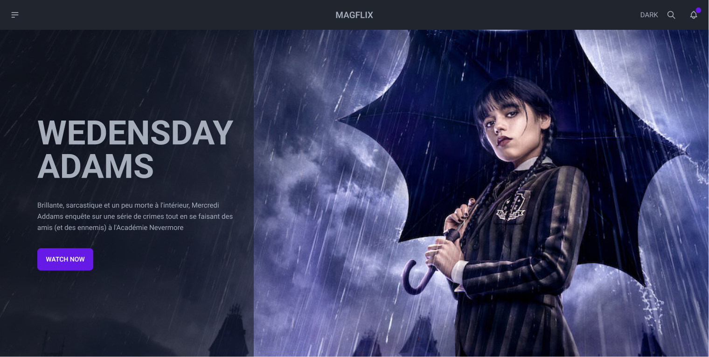

# Magflix

Magflix is a simple web application built using React and Tailwind CSS. It allows you to browse and search for movies and TV shows. This project serves as a basic template for building similar web applications.

## Installation

Pour installer Magflix sur votre système, suivez les étapes ci-dessous :

1. Assurez-vous d'avoir Node.js et npm installés sur votre ordinateur.

2. Clonez ce dépôt en utilisant la commande suivante :
   git clone https://github.com/votre-utilisateur/magflix.git

3. Accédez au répertoire du projet :
   cd magflix

4. Installez les dépendances en exécutant la commande :
   npm install

## Usage

Une fois que vous avez installé Magflix, vous pouvez le lancer en utilisant la commande suivante :

npm start
